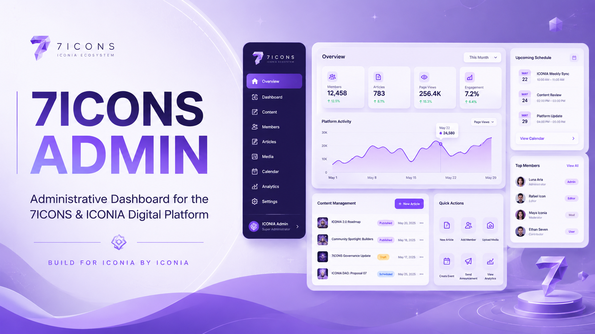

<p align="center">
  
</p>

<h1 align="center">7ICONS Admin</h1>

<p align="center">
  <strong>Administrative Dashboard for the 7ICONS & ICONIA Digital Platform</strong>
</p>

<p align="center">
  Internal management application for content, members, schedules,
  fan representatives, users, comments, and platform administration.
</p>

<p align="center">
  <strong>BUILD FOR ICONIA BY ICONIA</strong>
</p>

---

# 💜 About

**7ICONS Admin** is the internal administration dashboard for the
7ICONS & ICONIA digital ecosystem.

This application is designed to provide a centralized interface for
managing content that will eventually be displayed on the public
7ICONS website.

The Admin Panel is intentionally maintained as a separate application
from the public website.

```text
7ICONS Digital Ecosystem
│
├── 7icons-web
│   └── Public Website
│
└── 7icons-admin
    └── Internal Administration Dashboard
```

The two applications will eventually connect to the same backend and
database.

---

# 🎯 Purpose

The main purpose of `7icons-admin` is to remove the need to manually
edit source files whenever website content needs to be updated.

Currently, content on `7icons-web` is primarily stored inside local
TypeScript data files.

Example:

```text
src/data/blogArticles.ts
src/data/members.ts
src/data/schedule.ts
src/data/fanRepresentatives.ts
```

In the future, the architecture will move toward:

```text
Admin Dashboard
      ↓
Supabase Database
      ↓
7ICONS Public Website
```

An administrator will be able to create or update content through the
dashboard instead of modifying source code directly.

---

# 🏗 Project Architecture

The planned ecosystem architecture is:

```text
                    ┌─────────────────────┐
                    │      Supabase       │
                    │                     │
                    │ Authentication      │
                    │ PostgreSQL Database │
                    │ Storage             │
                    │ Row Level Security  │
                    └─────────┬───────────┘
                              │
                    ┌─────────┴──────────┐
                    │                    │
                    ▼                    ▼
          ┌─────────────────┐   ┌─────────────────┐
          │   7icons-web    │   │  7icons-admin  │
          │                 │   │                 │
          │ Public Website  │   │ Admin Dashboard │
          └────────┬────────┘   └────────┬────────┘
                   │                     │
                   ▼                     ▼
               Visitors              Admins
               Members               Editors
               ICONIA                Moderators
```

The public website and Admin Panel remain separate Next.js
applications while sharing the same backend infrastructure.

---

# 🧩 Related Projects

## Public Website

Repository:

```text
7ICONS/7icons-web
```

Production:

```text
https://7icons-web.vercel.app
```

Purpose:

```text
Public-facing digital home for 7ICONS & ICONIA.
```

---

## Admin Dashboard

Repository:

```text
7ICONS/7icons-admin
```

Purpose:

```text
Internal dashboard for managing the 7ICONS digital ecosystem.
```

Planned deployment:

```text
Vercel
```

Example deployment:

```text
https://7icons-admin.vercel.app
```

---

# 🛠 Planned Tech Stack

The Admin Panel is planned to use:

```text
Frontend
├── Next.js
├── React
├── TypeScript
├── Tailwind CSS
└── Next.js App Router

Backend
├── Supabase
├── PostgreSQL
├── Supabase Authentication
├── Supabase Storage
└── Row Level Security

Development
├── Git
├── GitHub
├── VS Code
└── npm

Deployment
└── Vercel
```

---

# 🎨 Design Direction

The Admin Panel should remain visually connected to the public
7ICONS website while using a more productivity-focused dashboard
interface.

Primary visual direction:

```text
White
Lavender
Violet
Purple Gradient
Soft Gray
Rounded Cards
Light Borders
Soft Shadows
Clean Dashboard Layout
```

The design should feel:

```text
Modern
Professional
Clean
Friendly
Organized
Fast
Consistent with 7ICONS Branding
```

The Admin Panel should **not** use a completely different visual
identity from `7icons-web`.

---

# 🖥 Planned Dashboard Layout

Initial desktop structure:

```text
┌──────────────────────────────────────────────────────────────┐
│ 7ICONS Admin                              Admin Profile ▼    │
├────────────────┬─────────────────────────────────────────────┤
│                │                                             │
│ Dashboard      │  Dashboard Overview                         │
│ Articles       │                                             │
│ Members        │  ┌─────────┐ ┌─────────┐ ┌─────────┐       │
│ Schedule       │  │Articles │ │ Members │ │ Events  │       │
│ Fan Reps       │  │         │ │         │ │         │       │
│ Users          │  └─────────┘ └─────────┘ └─────────┘       │
│ Comments       │                                             │
│                │  Recent Activity                            │
│ Settings       │                                             │
│                │  ───────────────────────────────────────    │
│                │                                             │
└────────────────┴─────────────────────────────────────────────┘
```

Primary shell:

```text
AdminLayout
│
├── Sidebar
├── Topbar
└── Main Content
```

---

# 🧭 Planned Routes

Initial route architecture:

```text
/
│
├── /login
│
├── /dashboard
│
├── /articles
│   ├── /new
│   └── /[id]/edit
│
├── /members
│   ├── /new
│   └── /[id]/edit
│
├── /schedule
│   ├── /new
│   └── /[id]/edit
│
├── /representatives
│   ├── /new
│   └── /[id]/edit
│
├── /users
│   └── /[id]
│
├── /comments
│
├── /media
│
└── /settings
```

Routes may evolve during development.

---

# 📊 Dashboard V1

The first dashboard version should provide a simple overview of the
platform.

Planned summary cards:

```text
Total Articles
Total Members
Upcoming Events
Fan Representatives
Registered Users
Pending Comments
```

Additional dashboard sections may include:

```text
Recent Content
Upcoming Schedule
Recent Admin Activity
Quick Actions
```

The first version should remain lightweight.

Advanced analytics are **not required for V1**.

---

# 📰 Article Management

The Articles module will eventually replace manual editing of:

```text
src/data/blogArticles.ts
```

Planned capabilities:

```text
View Articles
Create Article
Edit Article
Delete Article
Draft Article
Publish Article
Unpublish Article
Search Articles
Filter by Category
Manage Article Image
Manage Slug
Manage Publication Date
```

Possible article fields:

```text
id
title
slug
excerpt
content
category
cover_image
status
published_at
created_at
updated_at
created_by
updated_by
```

Possible statuses:

```text
Draft
Published
Archived
```

---

# 👥 Member Management

The Members module will eventually replace manual editing of:

```text
src/data/members.ts
```

Planned capabilities:

```text
View Members
Add Member
Edit Member
Manage Member Portrait
Change Member Status
Manage Member Profile
Manage Member Story
Reorder Members
Archive Former Members
```

Possible member statuses:

```text
Current
Former
```

Possible fields:

```text
id
name
slug
status
role
portrait
short_bio
about
personality
story
display_order
created_at
updated_at
```

---

# 📅 Schedule Management

The Schedule module will eventually replace manual editing of:

```text
src/data/schedule.ts
```

Planned capabilities:

```text
View Events
Create Event
Edit Event
Delete Event
Manage Event Category
Manage Date
Manage Time
Manage Location
Manage Description
Manage Event Status
```

Supported event categories:

```text
Performance
Fan Meeting
Livestream
TV
Other
```

The public website can automatically determine:

```text
Upcoming
Completed
```

based on the event date.

Possible fields:

```text
id
title
slug
type
date
time
location
description
created_at
updated_at
```

---

# 💜 Fan Representative Management

This module will eventually replace manual editing of:

```text
src/data/fanRepresentatives.ts
```

Planned capabilities:

```text
View Representatives
Add Representative
Edit Representative
Remove Representative
Manage Region
Manage City
Manage Portrait
Manage Instagram
Manage WhatsApp
Manage Community Mission
Manage Community Motto
Manage Representative Story
```

Possible fields:

```text
id
name
slug
region
city
role
portrait
instagram
whatsapp
representative_since
short_bio
mission
motto
story
created_at
updated_at
```

---

# 👤 User Management

This module will become relevant after authentication is implemented
on the public website.

Planned capabilities:

```text
View Registered Users
View User Profile
View Registration Date
View Account Status
Suspend User
Restore User
View Comment Activity
```

Administrators should **not** be able to view user passwords.

Passwords will be handled securely by the authentication provider.

---

# 💬 Comment Management

After the public comment system is implemented, admins will be able to
moderate comments from this dashboard.

Planned capabilities:

```text
View Comments
Search Comments
Filter Comments
Approve Comments
Hide Comments
Delete Comments
Review Reports
View Comment Author
```

Possible comment status:

```text
Published
Pending
Hidden
Removed
```

---

# 🖼 Media Management

A future Media section may provide centralized management for:

```text
Article Covers
Member Portraits
Representative Portraits
Community Images
Website Assets
```

Media storage is planned to use:

```text
Supabase Storage
```

This module does not need to be completed during the first development
phase.

---

# 🔐 Authentication

The Admin Panel must eventually require authentication.

Anonymous visitors must **never** have access to administrative
pages.

Expected behavior:

```text
Visitor opens Admin Panel
        ↓
Authentication Check
        ↓
Not Logged In
        ↓
/login
        ↓
Valid Admin Account
        ↓
/dashboard
```

Protected pages:

```text
/dashboard
/articles
/members
/schedule
/representatives
/users
/comments
/media
/settings
```

The login page itself remains public.

---

# 🛡 Admin Roles & Permissions

The architecture should be designed so multiple administrator roles
can be supported later.

Initial role concept:

```text
Super Admin
│
├── Full platform access
├── Manage administrators
├── Manage users
├── Manage content
└── Manage settings

Admin
│
├── Manage content
├── Manage members
├── Manage schedule
├── Manage representatives
└── Moderate comments

Editor
│
├── Manage articles
├── Manage schedule
└── Limited publishing permissions

Moderator
│
├── Moderate comments
└── Limited user moderation
```

V1 may initially use only:

```text
Super Admin
```

but the database should not prevent additional roles from being added
later.

---

# 🔒 Security Principles

Security must be treated as a core part of the Admin Panel.

Important principles:

```text
Never rely on hidden URLs for security.

Never expose Supabase service-role keys to the browser.

Never store passwords manually.

Every protected route must verify authentication.

Administrative actions must verify permissions.

Database access should use Row Level Security.

Sensitive environment variables must remain server-side.

Admin accounts should be separate from normal public users through
roles or permission records.
```

Knowing the Admin Panel URL must **not** be enough to access it.

---

# 🗄 Planned Backend

The planned backend platform is:

```text
Supabase
```

Supabase will potentially provide:

```text
Authentication
PostgreSQL Database
Storage
Row Level Security
User Management
Database API
```

Both:

```text
7icons-web
```

and:

```text
7icons-admin
```

will connect to the same Supabase project.

---

# 🗃 Planned Database Concept

Initial database architecture may eventually contain:

```text
profiles
admin_roles
articles
members
schedule_events
fan_representatives
comments
media
admin_activity
```

Relationship concept:

```text
auth.users
    │
    ▼
profiles
    │
    ├─────────────┐
    ▼             ▼
admin_roles     comments

articles
members
schedule_events
fan_representatives
media
```

The final schema will be designed before database implementation.

Do **not** create tables randomly before the schema has been reviewed.

---

# 📝 Admin Activity Log

A future activity log should record important administrative actions.

Examples:

```text
Admin created article
Admin edited member
Admin deleted event
Admin published article
Admin changed representative
Admin moderated comment
```

Possible structure:

```text
admin_id
action
entity_type
entity_id
description
created_at
```

This will improve accountability when multiple administrators are
introduced.

---

# ⚙️ Environment Variables

Environment variables will be configured later.

Expected examples:

```env
NEXT_PUBLIC_SUPABASE_URL=
NEXT_PUBLIC_SUPABASE_ANON_KEY=
```

Server-only secrets, if required, must never use the
`NEXT_PUBLIC_` prefix.

Actual environment variables should be stored in:

```text
.env.local
```

and must **not** be committed to GitHub.

---

# 📁 Planned Project Structure

The exact structure may evolve, but the initial target is:

```text
7icons-admin/
│
├── public/
│   └── brand/
│
├── src/
│   │
│   ├── app/
│   │   ├── login/
│   │   ├── dashboard/
│   │   ├── articles/
│   │   ├── members/
│   │   ├── schedule/
│   │   ├── representatives/
│   │   ├── users/
│   │   ├── comments/
│   │   ├── media/
│   │   ├── settings/
│   │   ├── globals.css
│   │   ├── layout.tsx
│   │   └── page.tsx
│   │
│   ├── components/
│   │   ├── dashboard/
│   │   ├── layout/
│   │   ├── forms/
│   │   └── ui/
│   │
│   ├── lib/
│   │   └── supabase/
│   │
│   ├── types/
│   │
│   └── utils/
│
├── .env.local
├── .gitignore
├── package.json
├── README.md
└── tsconfig.json
```

This structure is a target, not a requirement to create every folder
on the first day.

---

# 🚀 Local Development

Once the Next.js project has been created:

```bash
npm install
```

Start development:

```bash
npm run dev
```

Default development URL:

```text
http://localhost:3000
```

Before committing major changes:

```bash
npm run build
```

---

# ☁️ Deployment

The Admin Panel is planned to be deployed separately from the public
website.

Architecture:

```text
GitHub
│
├── 7icons-web
│       ↓
│     Vercel
│       ↓
│  Public Website
│
└── 7icons-admin
        ↓
      Vercel
        ↓
   Admin Dashboard
```

Both applications can use the same Supabase backend.

The Admin Panel deployment URL should **not** be treated as a security
mechanism.

Authentication and authorization remain mandatory.

---

# 🌿 Git Workflow

Primary development branch:

```text
main
```

Basic workflow:

```bash
git status
git add .
git commit -m "your commit message"
git push
```

Example commits:

```text
chore: initialize admin dashboard
feat: add admin dashboard layout
feat: add sidebar navigation
feat: add admin authentication
feat: add article management
feat: add member management
feat: add schedule management
fix: protect admin routes
docs: update admin documentation
```

---

# 🚦Development Phases

```text
PHASE 0 — Repository Preparation
├── GitHub repository
├── README
├── Banner
└── Initial planning

PHASE 1 — Application Foundation
├── Next.js setup
├── TypeScript
├── Tailwind CSS
├── Project structure
└── Base branding

PHASE 2 — Admin UI Foundation
├── Admin Login UI
├── Sidebar
├── Topbar
├── Dashboard Layout
└── Responsive Admin Shell

PHASE 3 — Dashboard V1
├── Summary Cards
├── Recent Activity UI
├── Upcoming Schedule UI
└── Quick Actions

PHASE 4 — Backend Foundation
├── Supabase project
├── Environment variables
├── Database connection
├── Authentication
└── Route protection

PHASE 5 — Content Management
├── Articles CRUD
├── Members CRUD
├── Schedule CRUD
└── Fan Representatives CRUD

PHASE 6 — Public Website Integration
├── Replace local data
├── Connect 7icons-web to database
├── Verify public rendering
└── Maintain fallback strategy

PHASE 7 — Community Management
├── Public user authentication
├── User management
├── Comments
├── Moderation
└── User profiles

PHASE 8 — Administration Expansion
├── Multiple admin roles
├── Permissions
├── Activity logs
├── Media management
└── Advanced settings
```

---

# 🚫 Not Required for V1

The first version of the Admin Panel does **not** need:

```text
Advanced Analytics
Real-time Collaboration
Complex Charts
Push Notifications
Email Campaigns
Multiple Themes
Custom Dashboard Builder
Advanced Media Editor
Full CMS Workflow
Mobile App
```

The priority is:

```text
Stable
Simple
Secure
Maintainable
Useful
```

---

# ✅ Current Status

```text
GitHub Repository                 ✅
Admin Concept                     ✅
Architecture Plan                 ✅
README Documentation              ✅
README Banner                     ✅

Next.js Application Setup         ⏳
Admin Branding Integration        ⏳
Admin Login UI                    ⏳
Dashboard Shell                   ⏳
Sidebar                           ⏳
Topbar                            ⏳
Dashboard V1                      ⏳
Vercel Deployment                 ⏳
Supabase Setup                    ⏳
Admin Authentication              ⏳
Protected Routes                  ⏳
Articles Management               ⏳
Members Management                ⏳
Schedule Management               ⏳
Fan Representatives Management   ⏳
User Management                   ⏳
Comment Moderation                ⏳
```

---

# 📌 Next Work Session

**Next development session: Wednesday, 2 September 2026.**

Do **not** start with Supabase or database tables immediately.

The first development session should follow this exact order:

```text
1. Clone 7icons-admin
        ↓
2. Create / initialize Next.js project
        ↓
3. Verify npm run dev
        ↓
4. Configure project structure
        ↓
5. Add 7ICONS Admin branding
        ↓
6. Create Admin Login UI
        ↓
7. Create Admin Layout
        ↓
8. Create Sidebar
        ↓
9. Create Topbar
        ↓
10. Create Dashboard V1
        ↓
11. Check desktop responsiveness
        ↓
12. Check tablet/mobile behavior
        ↓
13. npm run build
        ↓
14. Commit & Push
        ↓
15. Deploy Admin Panel to Vercel
```

Only after the Admin UI foundation is stable should development move
to:

```text
Supabase
↓
Authentication
↓
Route Protection
↓
Database
↓
CRUD
```

---

# 🎯 First Milestone

The first milestone is considered complete when:

```text
7icons-admin runs locally
        +
Admin Login UI exists
        +
Dashboard Shell exists
        +
Sidebar works
        +
Topbar works
        +
Dashboard V1 works
        +
Responsive layout works
        +
Production build succeeds
        +
GitHub is updated
        +
Vercel deployment is online
```

No real database is required to complete this milestone.

---

# 🏁 Long-Term Goal

The long-term goal is to transform the current architecture:

```text
Developer
    ↓
Edit TypeScript File
    ↓
Commit
    ↓
Push GitHub
    ↓
Deploy
```

into:

```text
Administrator
    ↓
7ICONS Admin
    ↓
Create / Edit Content
    ↓
Supabase
    ↓
7ICONS Web
    ↓
Content Updated
```

This allows the public website to evolve into a maintainable digital
platform instead of depending on manual source-code changes for every
content update.

---

# 💜 Project Philosophy

The Admin Panel exists behind the scenes so the public experience can
remain simple, organized, and focused on the community.

```text
Manage the platform.
Preserve the content.
Support the community.
Continue the story.
```

At the center of the ecosystem:

> **7ICONS creates the memories.**  
> **ICONIA helps keep them alive.**

---

<p align="center">
  <strong>7ICONS ADMIN</strong>
</p>

<p align="center">
  Administrative Dashboard for the 7ICONS & ICONIA Digital Platform
</p>

<p align="center">
  <strong>BUILD FOR ICONIA BY ICONIA</strong>
</p>